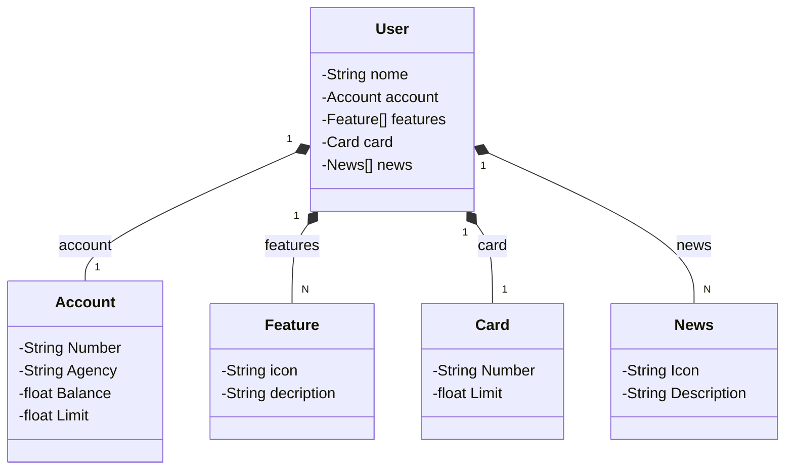

# Bootcamp Santender e Dio (Java back-end) 2025
Java RESTful API criada para o bootcamp do Santander.

##Diagrama de classes:

```mermaid

classDiagram
    class User {
        -String nome
        -Account account
        -Feature[] features
        -Card card
        -News[] news
    }
    
    class Account {
        -String Number
        -String Agency
        -float Balance
        -float Limit
    }

    class Feature {
        -String icon
        -String decription
    }

    class Card {
        -String Number
        -float Limit
    }

    class News {
        -String Icon
        -String Description
    }

    User "1" *--  "1" Account : account
    User "1" *-- "N" Feature : features
    User "1" *-- "1" Card : card
    User "1" *-- "N" News : news
```
